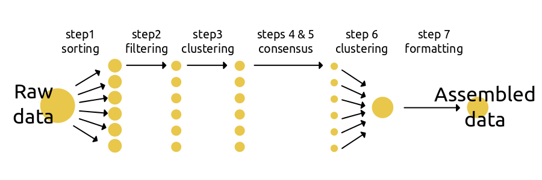
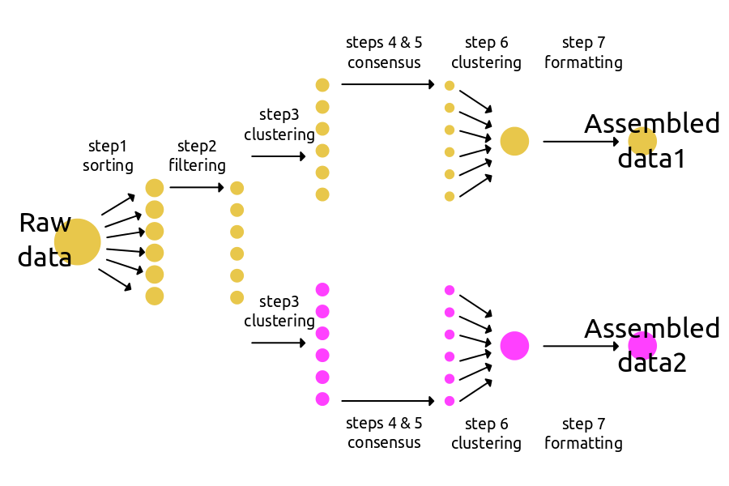

.. include:: global.rst

.. _outline:

Assembly Outline
================

The typical workflow to move from fastq formatted sequence data to assembled 
comparative data sets in ipyrad_ involves 
:ref:`seven sequential steps <seven_steps>`. 
The reason the it is separated into distinct steps is to create a modular 
workflow that can be easily restarted if it is interrupted, and can be easily
branched at different points so that one can test the effect of different
:ref:`parameter settings <Assembly_parameters>` during different stages of 
assembly on the final results.

Seven Steps
------------

1. Demultiplexing / Loading fastq files
^^^^^^^^^^^^^^^^^^^^^^^^^^^^^^^^^^^^^^^
Step 1 involves loading sequence data into a named :ref:`Assembly<Assembly>` and
sorting the sequences among a number of :ref:`Samples<Samples>` (individuals). 
If the data are not yet demultiplexed then step 1 uses information from a 
:ref:`barcodes file<barcodes_file>` to assign sequences to Samples. If the data 
are already demultiplexed then step 1 simply reads the data in to count how 
many reads are assigned to each Sample. 

The following :ref:`assembly parameters<parameters>` are *potentially*
used or required (\*) during step1: 
:ref:`*assembly_name<assembly_name>`, 
:ref:`*project_dir<project_dir>`, 
:ref:`raw_fastq_path<raw_fastq_path>`,
:ref:`barcodes_path<barcodes_path>`,
:ref:`sorted_fastq_path<sorted_fastq_path>`, 
:ref:`*datatype<datatype>`,
:ref:`restriction_overhang<restriction_overhang>`,
:ref:`max_barcode_mismatch<max_barcode_mismatch>`

2. Filtering / Editing reads
^^^^^^^^^^^^^^^^^^^^^^^^^^^^
Step 2 uses the quality score recorded in the fastQ data files to filter low 
quality base calls. Sites with a score below a set value are changed into “N”s, 
and reads with more than the number of allowed “N”s are discarded. An  
optional filter can be applied to remove adapters/primers, and there is an 
optional filter to clean up the edges of poor quality reads.

The following :ref:`parameters<parameters>` are *potentially*
used, or required (\*) during step2:
:ref:`*assembly_name<assembly_name>`, 
:ref:`*project_dir<project_dir>`, 
:ref:`barcodes_path<barcodes_path>`,
:ref:`*datatype<datatype>`,
:ref:`restriction_overhang<restriction_overhang>`,
:ref:`max_low_qual_bases<max_low_qual_bases>`,
:ref:`filter_adapters<filter_adapters>`,
:ref:`filter_min_trim_len<filter_min_trim_len>`
:ref:`edit_cut_sites<edit_cut_sites>`

3. Clustering / Mapping reads within Samples and alignment
^^^^^^^^^^^^^^^^^^^^^^^^^^^^^^^^^^^^^^^^^^^^^^^^^^^^^^^^^^
Step 3 first dereplicates the sequences from step 2, recording the number of 
times each unique read is observed. These are then either de novo clustered 
(using vsearch_) or mapped to a reference genome (using smalt_ and bedtools_), 
depending on the selected assembly method. In either case, reads are matched 
together on the basis of sequence similarity and the resulting clusters are 
aligned using muscle_. 

The following :ref:`parameters<parameters>` are *potentially*
used, or required (*) during step3:
:ref:`*assembly_name<assembly_name>`, 
:ref:`*project_dir<project_dir>`, 
:ref:`*assembly_method<assembly_method>`,
:ref:`*datatype<datatype>`,
:ref:`*clust_threshold<clust_threshold>`,

4. Joint estimation of heterozygosity and error rate
^^^^^^^^^^^^^^^^^^^^^^^^^^^^^^^^^^^^^^^^^^^^^^^^^^^^^
...

5. Consensus base calling and filtering
^^^^^^^^^^^^^^^^^^^^^^^^^^^^^^^^^^^^^^^^
...

6. Clustering / Mapping reads among Samples and alignment
^^^^^^^^^^^^^^^^^^^^^^^^^^^^^^^^^^^^^^^^^^^^^^^^^^^^^^^^^
...

7. Filtering and formatting output files
^^^^^^^^^^^^^^^^^^^^^^^^^^^^^^^^^^^^^^^^^
...

Schematic Example
------------------

Basic workflow
^^^^^^^^^^^^^^^
The basic workflow involves assembling a data set through the `seven steps`_ 
sequentially under a single set of parameters defined in the params file. 

**Example CLI basic workflow**

.. code-block:: bash

    ## Create a new params file using -n and name the assembly 'data1'.
    ## This creates file called data1-params.txt
    ipyrad -n data1

    ## Use a text editor to change setting in data1-params.txt
    ## and then run steps 1-7 using these settings.
    ipyrad -p data1-params.txt

**Example API basic workflow**

.. code-block:: python

    ## import ipyrad 
    import ipyrad as ip

    ## create an Assembly and modify some parameter settings
    data1 = ip.Assembly("data1")
    data1.set_params("project_dir", "example")
    data1.set_params("raw_fastq_path", "data/*.fastq")
    data1.set_params("barcodes_path", "barcodes.txt")   

    ## run steps 1-7, no args to run means run all steps.
    data1.run()

.. _branching_workflow:

Branching workflow
^^^^^^^^^^^^^^^^^^
A more efficient and effective way to use ipyrad_ is to create branching
assemblies in which multiple final data sets are assembled from the same
shared data by applying different parameter settings to them during different
steps of the assembly. The schematic and code example below shows how to branch
an assembly called 'data1' to create a new assembly 'data2' which inherits the 
files and statistics from data1, but then applies a different clustering 
threshold going forward for steps 3-7. You can envision many data sets generated
this way by havins successive branching events along each branch. 
You can find more branching examples in the tutorial_ and cookbook_ sections. 

**Example CLI branching workflow**

.. code-block:: bash

    ## create a params.txt file and rename it data1, and then use a text editor
    ## to edit the parameter settings in data1-params.txt
    ipyrad -n data1

    ## run steps 1-2 using the default settings
    ipyrad -p data1-params.txt -s 12

    ## branch to create a 'copy' of this assembly named data2
    ipyrad -p data1-params.txt -b data2

    ## edit data2-params.txt to a different parameter settings in a text editor,
    ## for example, change the clustering threshold from 0.85 to 0.90

    ## now run the remaining steps (3-7) on each data set
    ipyrad -p data1-params.txt -s 34567
    ipyrad -p data2-params.txt -s 34567

**Example Python API branching workflow**

.. code-block:: python

    ## import ipyrad 
    import ipyrad as ip

    ## create an Assembly and modify some parameter settings
    data1 = ip.Assembly("data1")
    data1.set_params("project_dir", "example")
    data1.set_params("raw_fastq_path", "data/*.fastq")
    data1.set_params("barcodes_path", "barcodes.txt")   

    ## run steps 1-2
    data1.run("12")

    ## create a new branch of this Assembly named data2
    ## and change some parameter settings 
    data2 = data1.copy("data2")
    data2.set_params("clust_threshold", 0.90)

    ## run steps 3-7 for the two Assemblies
    data1.run("34567")
    data2.run("34567")

Branching Architecture
----------------------
To better understand how branching works it helps to understand the underlying 
architecture of the API and how the data are store and reused between different
Assemblies. First it is important to define the objects we refer to as an 
Assembly_ and as Samples_. 

.. _Samples:  

Samples
^^^^^^^
Samples are created during step 1 and each Sample represent a unique barcoded
individual from the sequence data. Sample objects store information about where
that Sample's data is stored on the disk and the statistics before and after 
each step (nreads, nfiltered_reads, nclusters, etc.). 

.. _Assembly:  

Assembly
^^^^^^^^