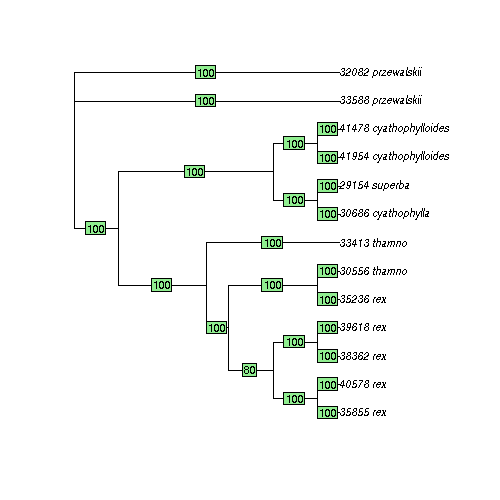

Inferring species trees with *tetrad*
=====================================

When you install *ipyrad* a number of analysis tools are installed as
well. This includes the program **tetrad**, which applies the theory of
phylogenetic invariants (see Lake 1987) to infer quartet trees based on
a SNP alignment. Given all of these quartet trees, *tetrad* then uses the 
software wQMC to join all quartets into a species tree that is consistent 
under the multi-species coalescent. This combined approach was first developed 
by Chifman and Kubatko (2015) in their software *SVDQuartets*.

What does *tetrad* do differently from *svdquartets*?
~~~~~~~~~~~~~~~~~~~~~~~~~~~~~~~~~~~~~~~~~~~~~~~~~~~~~
Not all that much currently. But we have several plans for future differences. 
Importantly, though, the code is free and open source, easy to install, 
and can be highly parallelized on a HPC cluster. The *tetrad* software is new 
and still has a lot of room for improvements in terms of speed, so stay tuned
as we work on it. Currently, for smallish trees it is fast enough to finish in a 
few seconds. It can handle enormous sized data sets in terms of the number of SNPs, 
but it slows down quite a lot when the number of tips becomes large (e.g., >100). 

.. note:: 

    tetrad is currently supported only on Linux, Mac support will be available soon.

CLI Reference
-------------

The command-line interface (CLI) to tetrad should be familiar to ipyrad
users since it was designed to be very similar. In the CLI examples
below the code should be executed in a terminal. *tetrad* takes a phylip
formatted sequence file as input. It is recommended that use only the
SNPs, which are contained in the ipyrad output file ending in
``.snps.phy``. A futher assumption of this method is that the SNPs are
unlinked. If you pass in the file ending in ``.snps.map`` then *tetrad*
will use this to sample only one SNP per locus when analyzing each
quartet sample in the analysis. This is the best way to maximize RAD-seq
information in a species tree analysis.

.. code:: python

    ## Code starting with >>> is intended to be run in a terminal (e.g., bash)
    ## print the help screen
    >>> tetrad -h

.. parsed-literal::
    usage: tetrad [-h] [-v] [-f] [-s seq] [-j json] [-m method] [-q nquartets]
                  [-b boots] [-l map_file] [-r resolve] [-n name] [-o outdir]
                  [-t starting_tree] [-c CPUs/cores] [-x random_seed] [-d] [--MPI]
                  [--ipcluster]
    
    optional arguments:
      -h, --help        show this help message and exit
      -v, --version     show program's version number and exit
      -f, --force       force overwrite of existing data
      -s seq            path to input phylip file (SNPs of full sequence file)
      -j json           load checkpointed/saved analysis from JSON file.
      -m method         method for sampling quartets (all, random, or equal)
      -q nquartets      number of quartets to sample (if not -m all)
      -b boots          number of non-parametric bootstrap replicates
      -l map_file       map file of snp linkages (e.g., ipyrad .snps.map)
      -r resolve        randomly resolve heterozygous sites (default=1)
      -n name           output name prefix (default: 'test')
      -o outdir         output directory (default: creates ./analysis_tetrad)
      -t starting_tree  newick file starting tree for equal splits sampling
      -c CPUs/cores     setting n Nodes improves parallel efficiency on HPC
      -x random_seed    random seed for quartet sampling and/or bootstrapping
      -d, --debug       print lots more info to debugger: ipyrad_log.txt.
      --MPI             connect to parallel CPUs across multiple nodes
      --ipcluster       connect to ipcluster instance with profile=ipyrad
    
      * Example command-line usage ---------------------------------------------- 
    
      * Read in sequence/SNP data file, provide linkage, output name, ambig option. 
         tetrad -s data.snps.phy -n test             ## input phylip and give name
         tetrad -s data.snps.phy -l data.snps.map    ## use one SNP per locus
         tetrad -s data.snps.phy -n noambigs -r 0    ## do not use hetero sites
    
      * Load saved/checkpointed analysis from '.tet.json' file, or force restart. 
         tetrad -j test.tet.json -b 100         ## continue 'test' until 100 boots
         tetrad -j test.tet.json -b 100 -f      ## force restart of 'test'
    
      * Sampling modes: 'equal' uses guide tree to sample quartets more efficiently 
         tetrad -s data.snps -m all                         ## sample all quartets
         tetrad -s data.snps -m random -q 1e6 -x 123        ## sample 1M randomly
         tetrad -s data.snps -m equal -q 1e6 -t guide.tre   ## sample 1M across tree
    
      * HPC optimization: Set -c to the number of nodes to improve efficiency
         tetrad -s data.phy -c 16               ## e.g., use 16 cores across 4 nodes
    
      * Documentation: http://ipyrad.readthedocs.org/en/latest/
        

Infer a tree
~~~~~~~~~~~~

In this example we are using the map file to partition the data set to
sample unlinked SNPs. We set a name for the assembly (pedictest) and an
output directory (testdir), both of which are optional. The default
method is to sample all quartets, alternatively, you can set it to
randomly sample some number of quartets. To start, let's also tell it to
do 10 bootstrap replicates.

.. code:: python

    ## Let's run the Pedicularis example data set through tetrad
    >>> tetrad -s pedicularis/pedic_outfiles/pedic.snps.phy \
               -l pedicularis/pedic_outfiles/pedic.snps.map \
               -n pedictest -o testdir -c 4 -b 10

.. parsed-literal::
    ----------------------------------------------------------------------
    tetrad [v.0.5.0]
    Quartet inference from phylogenetic invariants
    Distributed as part of the ipyrad.analysis toolkit
    ----------------------------------------------------------------------  

.. parsed-literal::    
    loading seq array [13 taxa x 173439 bp]
    max unlinked SNPs per quartet: 37581
    new Tetrad instance: pedictest
    local compute node: [4 cores] on tinus
  

.. parsed-literal::      
    inferring 715 induced quartet trees
    [####################] 100%  initial tree | 0:00:18 |  
    running 10 bootstrap replicates
    [####################] 100%  boot 1       | 0:00:08 |  
    [####################] 100%  boot 2       | 0:00:10 |  
    [####################] 100%  boot 3       | 0:00:08 |  
    [####################] 100%  boot 4       | 0:00:09 |  
    [####################] 100%  boot 5       | 0:00:08 |  
    [####################] 100%  boot 6       | 0:00:08 |  
    [####################] 100%  boot 7       | 0:00:08 |  
    [####################] 100%  boot 8       | 0:00:08 |  
    [####################] 100%  boot 9       | 0:00:08 |  

.. parsed-literal::      
    Statistics for sampling, discordance, and tree support:
      > /home/deren/Documents/ipyrad/tests/testdir/pedictest.stats.txt
      
    Best tree inferred from the full SNP array:
      > /home/deren/Documents/ipyrad/tests/testdir/pedictest.full.tre
      
    Extended majority-rule consensus over bootstraps w/ support as edge lengths:
      > /home/deren/Documents/ipyrad/tests/testdir/pedictest.consensus.tre
  
    All bootstrap trees:
      > /home/deren/Documents/ipyrad/tests/testdir/pedictest.boots
          

.. parsed-literal::        
                /-100.0, 33588_przewalskii
         /100.0, 
        |       \-100.0, 32082_przewalskii
        |
        |              /-100.0, 30686_cyathophylla
        |       /100.0, 
        |      |       \-100.0, 29154_superba
        |-100.0, 
    -0.0,      |       /-100.0, 41954_cyathophylloides
        |       \100.0, 
        |              \-100.0, 41478_cyathophylloides
        |
        |       /-100.0, 33413_thamno
        |      |
        |      |            /-100.0, 35236_rex
         \100.0,      /80.0, 
               |     |      \-100.0, 30556_thamno
               |     |
                \90.0,             /-100.0, 35855_rex
                     |      /100.0, 
                     |     |       \-100.0, 40578_rex
                      \80.0, 
                           |       /-100.0, 38362_rex
                            \100.0, 
                                   \-100.0, 39618_rex
  
    * For tips on plotting trees in R: ipyrad.readthedocs.org/cookbook.html     
    * For tips on citing this software: ipyrad.readthedocs.org/tetrad.html 
        

Run more bootstrap replicates
~~~~~~~~~~~~~~~~~~~~~~~~~~~~~
Bootstrap resampling samples loci with replacement to the same number of
loci as in the original data set. You can turn on bootstrapping by using
the -b flag. In addition, you can continue a previous run by loading the
JSON file with the -j flag, and setting a larger number of bootstrap
reps to run. The json file is saved in the output directory that was
designated.

.. code:: python

    ## continue from an existing analysis
    >>> tetrad -j testdir/pedictest.tet.json -b 20 -c 4

.. parsed-literal::
    ----------------------------------------------------------------------
    tetrad [v.0.5.0]
    Quartet inference from phylogenetic invariants
    Distributed as part of the ipyrad.analysis toolkit
    ----------------------------------------------------------------------  
    Continuing checkpointed analysis: pedictest
      sampling method: all
      bootstrap checkpoint: 9
      array checkpoint: 0
  
    local compute node: [4 cores] on tinus
  
    running 20 bootstrap replicates
    [####################] 100%  boot 10      | 0:00:18  
    [####################] 100%  boot 11      | 0:00:08  
    [####################] 100%  boot 12      | 0:00:07  
    [####################] 100%  boot 13      | 0:00:08  
    [####################] 100%  boot 14      | 0:00:08  
    [####################] 100%  boot 15      | 0:00:09  
    [####################] 100%  boot 16      | 0:00:09  
    [####################] 100%  boot 17      | 0:00:08  
    [####################] 100%  boot 18      | 0:00:08  
    [####################] 100%  boot 19      | 0:00:08  
  
    Statistics for sampling, discordance, and tree support:
      > /home/deren/Documents/ipyrad/tests/testdir/pedictest.stats.txt
      
    Best tree inferred from the full SNP array:
      > /home/deren/Documents/ipyrad/tests/testdir/pedictest.full.tre
      
    Extended majority-rule consensus over bootstraps w/ support as edge lengths:
      > /home/deren/Documents/ipyrad/tests/testdir/pedictest.consensus.tre
  
    All bootstrap trees:
      > /home/deren/Documents/ipyrad/tests/testdir/pedictest.boots
        
    
                /-100.0, 33588_przewalskii
         /100.0, 
        |       \-100.0, 32082_przewalskii
        |
        |              /-100.0, 30686_cyathophylla
        |       /100.0, 
        |      |       \-100.0, 29154_superba
        |-100.0, 
    -0.0,      |       /-100.0, 41954_cyathophylloides
        |       \100.0, 
        |              \-100.0, 41478_cyathophylloides
        |
        |       /-100.0, 33413_thamno
        |      |
        |      |            /-100.0, 35236_rex
         \100.0,      /90.0, 
               |     |      \-100.0, 30556_thamno
               |     |
                \95.0,             /-100.0, 35855_rex
                     |      /100.0, 
                     |     |       \-100.0, 40578_rex
                      \60.0, 
                           |       /-100.0, 38362_rex
                            \100.0, 
                                   \-100.0, 39618_rex
  
    * For tips on plotting trees in R: ipyrad.readthedocs.org/cookbook.html     
    * For tips on citing this software: ipyrad.readthedocs.org/tetrad.html 
        

API Reference
~~~~~~~~~~~~~

.. note:: 

    The ipyrad Python API code is intended to be run in IPython or in a Jupyter Notebook.

A more fun way to run *tetrad* is using the *ipyrad* Python API. Here you can
access the underlying Class objects in Python or IPython. As you'll see below, 
this can be particularly nice because *ipyrad* has some additional tools for
downstream analysis of the *tetrad* results. For example, *tetrad* saves
information that can be used to calculate ABBA-BABA test results. For more information
about using the *ipyrad* API `see this tutorial <http://ipyrad.readthedocs.io/tutorial-API.html>`__.

If you are using the API then you must have an ipcluster instance
started in order to parallelize your code. This can be started locally
by opening a separate terminal and running (``ipcluster start -n=10``)
to start 10 engines. Or, to run your code on a remote cluster set up
your ipcluster instance following `this tutorial <http://ipyrad.readthedocs.io/HPC_Tunnel.html>`__.

.. code:: python

    from ipyrad.analysis.tetrad import Tetrad

.. code:: python

    ## Create a Quartet Class object and enter default params
    data = Tetrad(name="api2",
                  wdir="testdir",
                  mapfile="pedicularis/pedic_outfiles/pedic.snps.map",
                  seqfile="pedicularis/pedic_outfiles/pedic.snps.phy")

.. parsed-literal::
    loading seq array [13 taxa x 173439 bp]
    max unlinked SNPs per quartet: 37581

.. code:: python

    ## Infer the best tree
    data.run()

.. parsed-literal::
    local compute node: [4 cores] on tinus
  
    inferring 715 induced quartet trees
    [####################] 100%  initial tree | 0:00:20 |  
  
    Statistics for sampling, discordance, and tree support:
      > /home/deren/Documents/ipyrad/tests/testdir/api2.stats.txt
      
    Best tree inferred from the full SNP array:
      > /home/deren/Documents/ipyrad/tests/testdir/api2.full.tre
      
    
                   /-38362_rex
                /-|
               |   \-39618_rex
             /-|
            |  |   /-35855_rex
            |   \-|
          /-|      \-40578_rex
         |  |
         |  |   /-30556_thamno
       /-|   \-|
      |  |      \-35236_rex
      |  |
      |   \-33413_thamno
      |
      |      /-29154_superba
      |   /-|
    --|  |   \-30686_cyathophylla
      |--|
      |  |   /-41478_cyathophylloides
      |   \-|
      |      \-41954_cyathophylloides
      |
      |   /-32082_przewalskii
       \-|
          \-33588_przewalskii
    
    * For tips on plotting trees in R: ipyrad.readthedocs.org/cookbook.html     
    * For tips on citing this software: ipyrad.readthedocs.org/tetrad.html 
        

.. code:: python

    ## run additional bootstrap replicates
    data.nboots = 10
    data.run()

.. parsed-literal::
    local compute node: [4 cores] on tinus
  
    running 10 bootstrap replicates
    [####################] 100%  boot 1       | 0:00:08 |  
    [####################] 100%  boot 2       | 0:00:09 |  
    [####################] 100%  boot 3       | 0:00:08 |  
    [####################] 100%  boot 4       | 0:00:09 |  
    [####################] 100%  boot 5       | 0:00:09 |  
    [####################] 100%  boot 6       | 0:00:07 |  
    [####################] 100%  boot 7       | 0:00:08 |  
    [####################] 100%  boot 8       | 0:00:08 |  
    [####################] 100%  boot 9       | 0:00:08 |  
  
    Statistics for sampling, discordance, and tree support:
      > /home/deren/Documents/ipyrad/tests/testdir/api2.stats.txt
      
    Best tree inferred from the full SNP array:
      > /home/deren/Documents/ipyrad/tests/testdir/api2.full.tre
      
    Extended majority-rule consensus over bootstraps w/ support as edge lengths:
      > /home/deren/Documents/ipyrad/tests/testdir/api2.consensus.tre
  
    All bootstrap trees:
      > /home/deren/Documents/ipyrad/tests/testdir/api2.boots
        
    
                /-100.0, 33588_przewalskii
         /100.0, 
        |       \-100.0, 32082_przewalskii
        |
        |              /-100.0, 30686_cyathophylla
        |       /100.0, 
        |      |       \-100.0, 29154_superba
        |-100.0, 
    -0.0,      |       /-100.0, 41954_cyathophylloides
        |       \100.0, 
        |              \-100.0, 41478_cyathophylloides
        |
        |       /-100.0, 33413_thamno
        |      |
        |      |              /-100.0, 35236_rex
         \100.0,       /100.0, 
               |      |       \-100.0, 30556_thamno
               |      |
                \100.0,             /-100.0, 35855_rex
                      |      /100.0, 
                      |     |       \-100.0, 40578_rex
                       \80.0, 
                            |       /-100.0, 38362_rex
                             \100.0, 
                                    \-100.0, 39618_rex
    
    * For tips on plotting trees in R: ipyrad.readthedocs.org/cookbook.html     
    * For tips on citing this software: ipyrad.readthedocs.org/tetrad.html 
        

Alternatively, sample a subset of quartets
~~~~~~~~~~~~~~~~~~~~~~~~~~~~~~~~~~~~~~~~~~

.. code:: python

    ## Create a Quartet Class object and enter params
    sub = Tetrad(name="api",
                 wdir="testdir",
                 method="random", 
                 nquartets=400, 
                 nboots=10,
                 mapfile="pedicularis/pedic_outfiles/pedic.snps.map",
                 seqfile="pedicularis/pedic_outfiles/pedic.snps.phy")
    
    ## run inference
    sub.run()

.. parsed-literal::
    loading seq array [13 taxa x 173439 bp]
    max unlinked SNPs per quartet: 37581
    local compute node: [4 cores] on tinus
  
    inferring 715 induced quartet trees
    [####################] 100%  initial tree | 0:00:09 |  
    running 10 bootstrap replicates
    [####################] 100%  boot 1       | 0:00:09 |  
    [####################] 100%  boot 2       | 0:00:09 |  
    [####################] 100%  boot 3       | 0:00:08 |  
    [####################] 100%  boot 4       | 0:00:08 |  
    [####################] 100%  boot 5       | 0:00:08 |  
    [####################] 100%  boot 6       | 0:00:08 |  
    [####################] 100%  boot 7       | 0:00:09 |  
    [####################] 100%  boot 8       | 0:00:08 |  
    [####################] 100%  boot 9       | 0:00:09 |  
  
    Statistics for sampling, discordance, and tree support:
      > /home/deren/Documents/ipyrad/tests/testdir/api.stats.txt
      
    Best tree inferred from the full SNP array:
      > /home/deren/Documents/ipyrad/tests/testdir/api.full.tre
      
    Extended majority-rule consensus over bootstraps w/ support as edge lengths:
      > /home/deren/Documents/ipyrad/tests/testdir/api.consensus.tre
  
    All bootstrap trees:
      > /home/deren/Documents/ipyrad/tests/testdir/api.boots
        
    
         /-100.0, 33413_thamno
        |
        |              /-100.0, 35236_rex
        |       /100.0, 
        |      |       \-100.0, 30556_thamno
        |      |
        |-100.0,             /-100.0, 35855_rex
        |      |      /100.0, 
        |      |     |       \-100.0, 40578_rex
    -0.0,       \80.0, 
        |            |       /-100.0, 38362_rex
        |             \100.0, 
        |                    \-100.0, 39618_rex
        |
        |              /-100.0, 33588_przewalskii
        |       /100.0, 
        |      |       \-100.0, 32082_przewalskii
        |      |
         \100.0,              /-100.0, 30686_cyathophylla
               |       /100.0, 
               |      |       \-100.0, 29154_superba
                \100.0, 
                      |       /-100.0, 41954_cyathophylloides
                       \100.0, 
                              \-100.0, 41478_cyathophylloides
    
    * For tips on plotting trees in R: ipyrad.readthedocs.org/cookbook.html     
    * For tips on citing this software: ipyrad.readthedocs.org/tetrad.html 
        

Plot the resulting tree in R
~~~~~~~~~~~~~~~~~~~~~~~~~~~~

The trees are unrooted and support values are on the edges. This can be
a bit confusing, but is in fact a recommended way to store support
values as it is more secure from being confused when trees are
re-rooted.

.. note::

    The code below should be run in R to produce a tree plot

.. code:: python
    
    ## load ape
    library(ape)
    
    ## read in the tree, root it, and ladderize
    tre <- read.tree("~/Documents/ipyrad/tests/testdir/api.consensus.tre")
    rtre <- root(tre, c("33588_przewalskii", "32082_przewalskii"))
    ltre <- ladderize(rtre)
    
    ## plot the tre
    plot(ltre, use.edge.length=FALSE)
    edgelabels(ltre$edge.length)

Introgression analysis from *tetrad* results
~~~~~~~~~~~~~~~~~~~~~~~~~~~~~~~~~~~~~~~~~~~~

